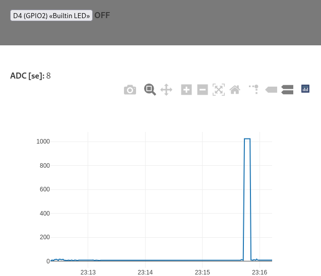

_codebase inspired by https://gitlab.com/superfly/dawndoor_


**MicroPython project template with a mini web framework**

# Example
```
curl -i 192.168.1.46/gpio?number=0
> HTTP/1.0 200 NA
> Content-Type: application/json
>
> {"value": 1, "ok": true}

curl -i -d '{"number":2,"value":"t"}' -X POST 192.168.1.46/gpio
> HTTP/1.0 200 NA
> Content-Type: application/json
>
> {"value": 0, "ok": true}
```

&nbsp;

## esp8266-ADC + Plotly



&nbsp;

# Prerequisites
```bash
pip install esptool mpfshell
```


# Instructions
Build the docker image, compile and copy the firmware
```bash
MPY_PORT=esp8266 ./compile.sh
```

Write the firmware (Warning: this will erase the flash!)
```bash
./write_flash.sh [PORT]
```
